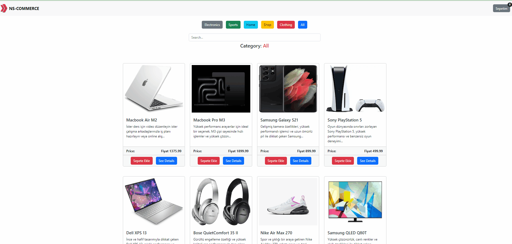
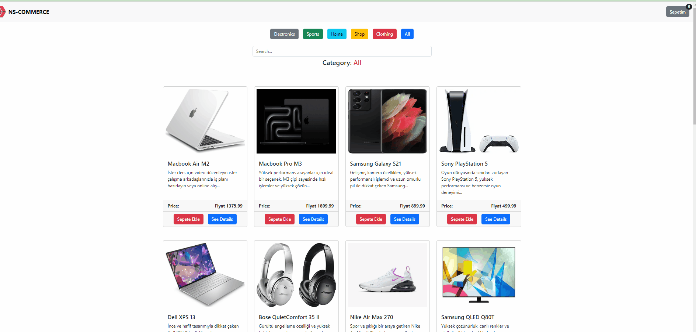

# E-COOMERCE SITE WITH JAVASCRIPT

https://ns-ecommerce-site.netlify.app/

-In this project, an e-commerce site was built using only javascript css and html. Bootstrap was preferred as css library.

-The following JavaScript methods were used to do these: addEventListener , forEach , createElement , appendChild , filter , find , reduce , map ...

-Data was fetched with async await structure in API.

-Separate buttons were created according to the category of each product. When the button of each category is pressed,
the products belonging to that category are displayed on the screen with filtering.

-The feature of adding or removing products to the cart by selecting them from the category pages was given and the feature of calculating the amount of products in the cart and the total amount was given.

- It was given the opportunity to access product details in the modal that opens when clicking the Product Details button

